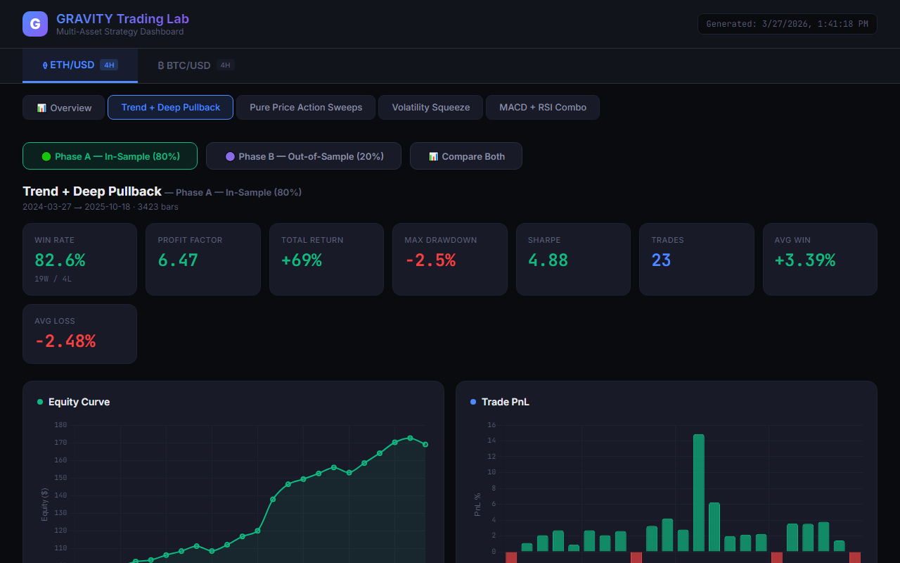

# GRAVITY Trading Lab - Live System

## Overview
Gravity Alert Bot is an automated multi-asset algorithmic trading system designed for ETH and BTC on specific timeframes (e.g., 4H).
It features live monitoring, telegram alerts for calculated signals, and an interactive dashboard for displaying backtest data, win rates, and live PNL metrics.

## Performance Dashboard (80%+ Win Rate Strategies)
The following is an automated capture of our unified dashboard, highlighting our rigorously tested strategies, including the Trend + Deep Pullback which holds over an **80% win rate**.



## Architecture
- `app.py`: Primary live engine using FastAPI, `loguru` for clean logging, and a background thread for calculating and verifying signals every 60 seconds against Market Data.
- `dashboard.html`: Fully responsive UI for reviewing metrics, trades, equity curves, and comparisons.
- `unified_dashboard_data.json`: Compiled JSON object storing backtests and calculated In-Sample (80%) vs Out-of-Sample results.

## Quick Start
1. Ensure your `.env` contains:
```env
TG_TOKEN=<bot-token>
TG_CHAT_ID=<chat-id>
```
2. Install dependencies: `pip install -r requirements.txt loguru`
3. Run the live engine: `python app.py`
4. Access the UI via `http://localhost:8000`
